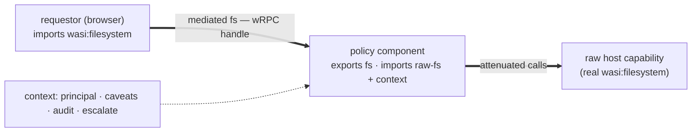

# Building the real icanhaz

The v0/v1 terminal proves the loop (browser ⇄ daemon ⇄ PTY). "Real" means three
things land:

1. **wRPC** carries the `provider` world (not a hand-rolled WS bridge).
2. The daemon **embeds wasmtime** and runs capabilities as *components*.
3. A **client app raises permission dialogs**, where the user **restricts scope**
   or supplies a capability **as code**.

The unifying idea — the thing worth getting right before any code — is that
**(2) and the "restrict scope / capability as code" half of (3) are the same
mechanism: a policy component.** The WIT for it is in [`wit/policy.wit`](wit/policy.wit)
and validates.

---

## Capability = raw authority + a policy membrane

A grant is never the raw capability. It's the raw capability **wrapped by a policy
component** — a wasm component that *re-exports* a capability interface and
implements it by delegating, attenuated, to the raw one it imports, plus a
`context` (who's asking, the caveats, an audit sink, a runtime-`escalate` hook).

The component model makes this clean: a component can **import and export the
same interface** (`world fs-policy` does exactly this — verified). wasmtime
*composes* `requestor → policy → raw`, and the requestor just sees a normal
`wasi:filesystem` handle over wRPC, never the raw one.

### Two authors, one mechanism

`request(want, reason, via)` where `via` is a `mediation.selection`:

- **`attenuate(caveats)`** — the built-in policy: a parameterised attenuator
  (`only-paths`, `expires`, `max-bytes`, …). This is "restrict scope," no code.
- **`component("sha256:…")`** — *capability as code*: the user's own policy
  component, resolved from the host's content-addressed store. They vouch for it
  once; the dialog shows its hash + declared world.

So a path-jailed home directory and a hand-written copy-on-write/audited/rate-limited
filesystem are the *same* grant shape — one's parameters, the other's a component.

Example policies (all just `world fs-policy` / `…-policy` components):
- **path-jail** — fs scoped to one subtree (the default attenuator).
- **overlay** — writes go to a scratch layer; reads fall through (safe `rm -rf`).
- **audited net** — `wasi:sockets` that logs every connection and `escalate`s
  on a non-allowlisted host.
- **read-only** — drops every write method.

---

## The permission dialog (the client app)

The dialog is **driven by the request's WIT type**, so it's introspectable, not
hand-built per capability:

1. Requestor calls `session.request(want, reason, via)`. The daemon doesn't act
   yet — it raises a dialog in the icanhaz client.
2. The dialog renders: **who** (origin/principal), **what** (`capability-kind` +
   its requested params), **why** (`reason`), and **scope controls** generated
   from the request record (a folder picker for `fs`, host/port rules for
   `sockets`, a duration for `expires`).
3. The user **narrows** (adds caveats — monotonic, only ever tighter) and **picks
   a policy**: the built-in attenuator (default) or a trusted component by hash.
4. On approve, the daemon mints the grant: instantiate the policy, compose it over
   the raw capability, return a wRPC handle to the *mediated* interface.
5. **Runtime escalation**: a policy can call `context.escalate("…")` mid-flight to
   raise a second, in-context dialog (e.g. "this wants to write outside ~/notes").
6. **Audit + revoke**: every grant has an audit trail (`context.audit`) and a kill
   switch (`capability.revoke`, which tears down delegations too).

Where the dialog runs depends on the device: on the Mac, icanhazd's own UI; from
the phone, a paired-device approval (durable grants + `session.resume` cover the
"approve once" case).

---

## Inside the daemon (wasmtime + wRPC)

- **Host:** `wasmtime::component::bindgen!` the `provider` world; implement the
  broker + the raw capabilities (PTY, real `wasi:filesystem`, `wasi:sockets`) as
  host traits. wasmtime **41/43** are already in the cargo cache.
- **Policy engine:** on grant, load the policy component, `Linker`-link its
  imports (raw capability + `policy/context`), instantiate, and hand the
  requestor its *export*. The built-in attenuator is just a bundled component.
- **wRPC:** serve `provider` with `wrpc-transport`; resource handles + the
  `wasi:io` streams travel as wRPC handles/streams.
- **Store:** content-addressed component store (`sha256:…`) for user policies; a
  grant records `{ principal, kind, caveats, policy-hash }` and is resumable.

---

## Transports

Tailscale stays the substrate (identity · WireGuard · MagicDNS TLS). The open
fork is **browser ⇄ daemon**:

- **Hybrid** — keep the WS-RPC bridge for the browser; use real wRPC + wasmtime
  *inside* the daemon (component composition) and wRPC to native peers. The
  wasmtime/policy value lands now; the browser link stays simple. Lowest risk.
- **Real wRPC end-to-end** — a TS wRPC-over-WSS transport (reimplement wRPC's
  codec + multiplexed framing in TS). Purest; largest unknown.
- **wRPC→wasm via jco** — compile a wRPC client to wasm, drive it from the browser.

---

## Staged plan

| # | Step | Verifiable how |
|---|---|---|
| 1 | **Policy/attenuation WIT** (done) | `wasm-tools component wit` ✓ |
| 2 | A real **policy component** (path-jail `fs-policy`) | `cargo-component build` (needs install) |
| 3 | **wasmtime host**: bindgen `provider`, run + compose a policy | `cargo check`/run against wasmtime 41/43 — *needs iteration on your machine* |
| 4 | **wRPC** serve `provider` (transport per the fork) | end-to-end with the daemon |
| 5 | **Permission dialog** app (scope controls + policy picker + escalate) | against the daemon |
| 6 | Swap markdown-editor's client onto the wRPC `client` world | the terminal still works |

Steps 1–2 are fully verifiable here. **3–4 are the frontier** — wasmtime's
component-host API and wRPC's surface move fast and I can't compile-verify them
blind; they want to be built iterating against the real crates on your machine.

## Honest unknowns

- **Browser-side wRPC.** No off-the-shelf transport; this is the biggest open
  question (hence the fork above).
- **`context.escalate` under Preview 2.** A host call that blocks on a human is
  awkward in the poll model; Preview 3's `future<bool>` is the clean form.
- **Policy trust.** A user policy component is sandboxed wasm, but it still sees
  the raw capability — so the *content-addressed, vouched-once* model and a clear
  "what can this policy touch" summary in the dialog are load-bearing.
- **Cross-device consent.** Approving on the Mac while driving from the phone
  needs durable grants + (ideally) push-to-approve.
