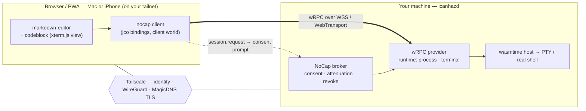

# `icanhaz`

> a cross-platform application to supercharge your browser — let web apps and
> PWAs reach **real** capabilities your machine has but the browser won't grant,
> with explicit, attenuated consent.

Built on **NoCap** (Negotiated Object-Capability Protocol): an open protocol for
peers to discover, request, grant, and revoke capabilities. `icanhaz` is the
user-facing consent surface; a daemon (`icanhazd`) on a machine you trust
furnishes the capabilities the browser is missing — primarily **WASI (and
extended)** interfaces, so you can build real applications that run in a browser
tab.

> **Status: design scaffold.** This directory contains the architecture, the
> WIT contracts (`wit/`), and crate/package skeletons. The daemon and browser
> client are not implemented yet — see [Status](#status--whats-hard).

---

## The target use case

Open an **interactive terminal to your own machine** from `markdown-editor`
running in a browser/PWA — on macOS *and* iOS — and have it be usable by anyone
who runs their own `icanhazd`.

A codeblock in a note says "run this," or you just hit `⌘K → terminal`, and a
live shell to your Mac opens inline. The phone is only a browser; the shell runs
on the Mac.

---

## Three layers, each doing one job

The thing that makes this tractable is that nothing here reinvents what another
layer already does well:

| Layer | Job | What it is |
|---|---|---|
| **Tailscale** | *reach + identity + crypto* | WireGuard mesh between your devices, NAT traversal, device identity, and a real TLS cert for the daemon via `tailscale serve` |
| **NoCap** | *whether* | object-capability consent: a web origin *requests* a capability, you *grant* (and *attenuate*) it, it's *revocable* and *audited* |
| **wRPC** | *how* | [bytecodealliance/wrpc](https://github.com/bytecodealliance/wrpc) — transport-agnostic, Component-Model-native RPC that carries handles, async, and **streams** between a WIT `client` world and a `provider` world |

Because Tailscale owns the network, NoCap shrinks to *application* consent (which
web app may do what, narrowed how) and never has to deal with pairing, MITM, or
the public internet. Because wRPC is component-native, the browser literally
*imports* the WASI interfaces it wants and the daemon *exports* them — wRPC
bridges them over the wire, streams and resource handles included.

### Where wRPC fits

`icanhazd` serves the [`provider` world](wit/worlds.wit) over wRPC. The browser
links the [`client` world](wit/worlds.wit), whose imports (`broker`, `runtime`,
`wasi:io`) are satisfied *remotely* by the daemon. A `terminal`'s `stdin`/`stdout`
are ordinary `wasi:io` streams — wRPC streams them across the tailnet. NoCap sits
*in front* of the dispatch: the daemon only routes a wRPC invocation to the real
handler if the caller presents a valid, unrevoked `capability`. **wRPC moves the
bytes; NoCap decides if it's allowed to.**

---

## Architecture



### Opening the terminal

```mermaid
sequenceDiagram
  actor U as You
  participant B as markdown-editor (browser)
  participant D as icanhazd (your Mac)

  Note over B,D: both on your tailnet; D served at https://mac.&lt;tailnet&gt;.ts.net
  B->>D: connect (wRPC over WSS, via Tailscale)
  B->>D: session.request(terminal{ jailed:false }, "open a shell")
  D->>U: icanhaz prompt — "this web app wants a terminal to your Mac"
  U->>D: Approve (attenuate: 30 min · this tab)
  D-->>B: capability
  B->>D: capability.claim-terminal()
  D-->>B: terminal (PTY handle)
  B-->>D: stdin stream (keystrokes)
  D-->>B: stdout stream (output)
  Note over B,D: live interactive terminal inside the codeblock
```

When you're remote from the Mac (e.g. on the iPhone), you can't click a prompt
that renders on the Mac — so the broker supports **durable grants**: approve once
locally, then `session.resume(grant-id)` reconnects without a prompt (optionally
with re-approval pushed to any tailnet device).

### Why iOS just works here

Earlier the hard question was "can `icanhaz` be a local provider on iOS?" — and
the answer was *no* (no background daemon, no JIT / dynamic code, no
native-messaging). Tailscale dissolves the question: **on iOS you are never the
provider.** Safari is the client, the Tailscale app provides reach, and every
limitation (subprocesses, the host shell, dynamic code) lives on the Mac. iOS
needs only a secure-context WebSocket to the daemon's `*.ts.net` endpoint — which
it has.

---

## WASI Preview 2 vs Preview 3

**Recommendation: build on Preview 2 now, design for Preview 3.** The WIT in
`wit/` is intentionally P2-shaped, with the P3 form noted inline.

**Preview 2 (`0.2.x`)** is what the toolchain ships *today* — `wasmtime`, `jco`
(the browser/JS side), `wit-bindgen`, and `wrpc` all support it. Its async is
the poll model: `wasi:io/poll.pollable` + `wasi:io/streams.{input,output}-stream`.
So a `terminal` is an `input-stream`/`output-stream` pair, and a pending consent
is a `grant-request` resource you `subscribe` + `get`. Slightly verbose, but it
runs.

**Preview 3** adds **native async to the Component Model** — first-class
`future<T>` and `stream<T>` and async functions — which fits this design almost
perfectly:

```wit
// P3: the same contracts, dramatically cleaner
resource session {
  request: func(want: capability-kind, reason: string)
    -> future<result<capability, denied>>;     // consent is just a future
}
resource terminal {
  stdin:  stream<u8>;                            // bidirectional byte streams,
  stdout: stream<u8>;                            // no pollable plumbing
}
```

**Why not target P3 today:** it's a moving target and the tooling isn't all
there yet — `wasmtime`'s async/P3 support lands incrementally, `wit-bindgen` P3
codegen is evolving, and the long pole is **`jco` async in the browser** (the
exact surface this feature depends on). The stable WASI worlds are still `0.2.x`.

**Why it's a cleanup, not a blocker:** wRPC is *already* async- and
stream-native on the wire, so streaming the PTY works on P2 — P3 only improves
*guest ergonomics*, not the capability. The migration is mechanical:

- bump `wasmtime` / `wit-bindgen` / `jco` / `wrpc` bindings to P3-capable releases,
- replace `grant-request` (poll) with `future<result<…>>`,
- replace the `input-stream`/`output-stream` pairs with `stream<u8>`,
- regenerate bindings; rewrite the host impls against the async component ABI.

Keep the interface seams where they are and it's a swap, not a rewrite.

---

## The contracts (`wit/`)

| File | Contains |
|---|---|
| [`wit/nocap.wit`](wit/nocap.wit) | `interface types` — principals, `capability-kind`, attenuation `caveat`s, `denied` reasons |
| [`wit/runtime.wit`](wit/runtime.wit) | `interface runtime` — `process-host`, `process`, and the `terminal` PTY |
| [`wit/worlds.wit`](wit/worlds.wit) | `interface broker` (the `capability` + `session` resources) and the `client` / `provider` **worlds** |

The shape to notice: a `capability` is an unforgeable, attenuable, revocable
handle; `capability.claim-terminal()` hands back a *standard* resource you then
just use; and `world client` is "a WASI world + `broker`" — which is the whole
pitch in a few lines.

---

## Repository layout

```
src/apps/icanhaz/
  README.md            ← you are here
  wit/                 ← NoCap + runtime contracts (WIT)
    nocap.wit
    runtime.wit
    worlds.wit
    deps/              ← vendored WASI packages (wasi:io, wasi:clocks, …)
  daemon/              ← `icanhazd`: Rust, wasmtime host + wRPC provider  (workspace member)
    Cargo.toml
    src/main.rs
  web/                 ← browser nocap client (jco bindings + a wRPC/WSS transport)
    package.json
    src/index.ts
```

`markdown-editor`/`codeblock` consume the `web/` client behind the
backend-agnostic `Runtime` interface discussed in design — `icanhaz` is just one
implementation of it (others: in-browser WASM, a local companion, a peer).

---

## Security model — *this is the product*

Opening a terminal to your machine from a web page is remote-code-execution by
design. Tailscale removes the network-trust problems; what's left is the
*application* trust boundary, and it has to hold:

- **Default deny.** No capability without an explicit `session.request` + grant.
- **Origin-bound.** Every capability binds to the requesting principal (web
  origin / installed-app id). No confused-deputy: site A can't use site B's grant.
- **Attenuate by default.** Grant the narrowest thing — `terminal{ jailed:true }`
  (a sandboxed shell) unless you *explicitly* clear `jailed` for the real host
  shell; caveats add expiry / idle-timeout / byte caps. Narrowing is monotonic
  (macaroon-style); a delegate can only ever weaken.
- **Two sandboxes.** icanhaz consent decides what a site may *ask*; the daemon
  still runs the granted code jailed (container / restricted shell) so a grant is
  a hole, not the whole house.
- **Revocable + audited.** A live dashboard of who holds what; revoking a
  capability tears down everything delegated from it.
- **Consent must stay legible.** The real failure mode is fatigue — these prompts
  are far scarier than a cookie banner and must read like it ("this web app wants
  a terminal to your Mac"), with the narrowed scope shown before you approve.

---

## Status / what's hard

Honest list of what isn't built and where the real work is:

- **Browser-side wRPC transport.** wRPC is Rust-first (NATS / QUIC / TCP / Unix
  transports). The browser needs a wRPC client over **WSS** (safe on iOS Safari
  today; **WebTransport** as the upgrade once Safari's HTTP/3 support is solid) —
  either a TS implementation of the wire protocol or a wRPC client compiled to
  wasm and driven by `jco`. This is the main unknown.
- **`jco` bindings for the `client` world**, and the async glue (the P2→P3 risk
  above lives here).
- **`icanhazd`:** wasmtime host serving the `provider` world over wRPC; the NoCap
  broker (grant store, attenuation, revocation); the consent UI; `terminal` via a
  host PTY (`portable-pty`); `tailscale serve` integration for the TLS endpoint.
- **The consent UX** — durable grants, remote approval, the audit dashboard.

---

## Getting started (scaffold)

```sh
# daemon (once implemented)
cargo run -p icanhazd

# expose it on your tailnet with a real cert
tailscale serve https / http://127.0.0.1:7777

# browser client
cd src/apps/icanhaz/web && pnpm install && pnpm build
```

WASI deps for the WIT are vendored under `wit/deps/` — see
[`wit/deps/README.md`](wit/deps/README.md).
