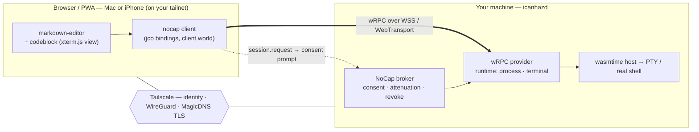

# `icanhaz`

> a cross-platform application to supercharge your browser — let web apps and
> PWAs reach **real** capabilities your machine has but the browser won't grant,
> with explicit, attenuated consent.

Built on **NoCap** (Negotiated Object-Capability Protocol): an open protocol for
peers to discover, request, grant, and revoke capabilities. `icanhaz` is the
user-facing consent surface; a daemon (`icanhazd`) on a machine you trust
furnishes the capabilities the browser is missing — primarily **WASI (and
extended)** interfaces, so you can build real applications that run in a browser
tab.

> **Status: terminal works end-to-end; broadening to the full capability set.**
> The daemon, the browser client, and an in-editor terminal block are implemented
> and compile — see [Running the v0 terminal](#running-the-v0-terminal) and
> [Embedding a terminal in a note](#embedding-a-terminal-in-a-note). The transport
> is a multiplexed capability RPC modelled on **wRPC**; the validated WIT in
> [`wit/`](wit/) is the contract for wire-compatible wRPC + the remaining
> capabilities — see [Status / roadmap](#status--roadmap).

---

## The target use case

Open an **interactive terminal to your own machine** from `markdown-editor`
running in a browser/PWA — on macOS *and* iOS — and have it be usable by anyone
who runs their own `icanhazd`.

A codeblock in a note says "run this," or you just hit `⌘K → terminal`, and a
live shell to your Mac opens inline. The phone is only a browser; the shell runs
on the Mac.

---

## Three layers, each doing one job

The thing that makes this tractable is that nothing here reinvents what another
layer already does well:

| Layer | Job | What it is |
|---|---|---|
| **Tailscale** | *reach + identity + crypto* | WireGuard mesh between your devices, NAT traversal, device identity, and a real TLS cert for the daemon via `tailscale serve` |
| **NoCap** | *whether* | object-capability consent: a web origin *requests* a capability, you *grant* (and *attenuate*) it, it's *revocable* and *audited* |
| **wRPC** | *how* | [bytecodealliance/wrpc](https://github.com/bytecodealliance/wrpc) — transport-agnostic, Component-Model-native RPC that carries handles, async, and **streams** between a WIT `client` world and a `provider` world |

Because Tailscale owns the network, NoCap shrinks to *application* consent (which
web app may do what, narrowed how) and never has to deal with pairing, MITM, or
the public internet. Because wRPC is component-native, the browser literally
*imports* the WASI interfaces it wants and the daemon *exports* them — wRPC
bridges them over the wire, streams and resource handles included.

### Where wRPC fits

`icanhazd` serves the [`provider` world](wit/worlds.wit) over wRPC. The browser
links the [`client` world](wit/worlds.wit), whose imports (`broker`, `runtime`,
`wasi:io`) are satisfied *remotely* by the daemon. A `terminal`'s `stdin`/`stdout`
are ordinary `wasi:io` streams — wRPC streams them across the tailnet. NoCap sits
*in front* of the dispatch: the daemon only routes a wRPC invocation to the real
handler if the caller presents a valid, unrevoked `capability`. **wRPC moves the
bytes; NoCap decides if it's allowed to.**

---

## Architecture



### Opening the terminal

```mermaid
sequenceDiagram
  actor U as You
  participant B as markdown-editor (browser)
  participant D as icanhazd (your Mac)

  Note over B,D: both on your tailnet; D served at https://mac.&lt;tailnet&gt;.ts.net
  B->>D: connect (wRPC over WSS, via Tailscale)
  B->>D: session.request(terminal{ jailed:false }, "open a shell")
  D->>U: icanhaz prompt — "this web app wants a terminal to your Mac"
  U->>D: Approve (attenuate: 30 min · this tab)
  D-->>B: capability
  B->>D: capability.claim-terminal()
  D-->>B: terminal (PTY handle)
  B-->>D: stdin stream (keystrokes)
  D-->>B: stdout stream (output)
  Note over B,D: live interactive terminal inside the codeblock
```

When you're remote from the Mac (e.g. on the iPhone), you can't click a prompt
that renders on the Mac — so the broker supports **durable grants**: approve once
locally, then `session.resume(grant-id)` reconnects without a prompt (optionally
with re-approval pushed to any tailnet device).

### Why iOS just works here

Earlier the hard question was "can `icanhaz` be a local provider on iOS?" — and
the answer was *no* (no background daemon, no JIT / dynamic code, no
native-messaging). Tailscale dissolves the question: **on iOS you are never the
provider.** Safari is the client, the Tailscale app provides reach, and every
limitation (subprocesses, the host shell, dynamic code) lives on the Mac. iOS
needs only a secure-context WebSocket to the daemon's `*.ts.net` endpoint — which
it has.

---

## WASI Preview 2 vs Preview 3

**Recommendation: build on Preview 2 now, design for Preview 3.** The WIT in
`wit/` is intentionally P2-shaped, with the P3 form noted inline.

**Preview 2 (`0.2.x`)** is what the toolchain ships *today* — `wasmtime`, `jco`
(the browser/JS side), `wit-bindgen`, and `wrpc` all support it. Its async is
the poll model: `wasi:io/poll.pollable` + `wasi:io/streams.{input,output}-stream`.
So a `terminal` is an `input-stream`/`output-stream` pair, and a pending consent
is a `grant-request` resource you `subscribe` + `get`. Slightly verbose, but it
runs.

**Preview 3** adds **native async to the Component Model** — first-class
`future<T>` and `stream<T>` and async functions — which fits this design almost
perfectly:

```wit
// P3: the same contracts, dramatically cleaner
resource session {
  request: func(want: capability-kind, reason: string)
    -> future<result<capability, denied>>;     // consent is just a future
}
resource terminal {
  stdin:  stream<u8>;                            // bidirectional byte streams,
  stdout: stream<u8>;                            // no pollable plumbing
}
```

**Why not target P3 today:** it's a moving target and the tooling isn't all
there yet — `wasmtime`'s async/P3 support lands incrementally, `wit-bindgen` P3
codegen is evolving, and the long pole is **`jco` async in the browser** (the
exact surface this feature depends on). The stable WASI worlds are still `0.2.x`.

**Why it's a cleanup, not a blocker:** wRPC is *already* async- and
stream-native on the wire, so streaming the PTY works on P2 — P3 only improves
*guest ergonomics*, not the capability. The migration is mechanical:

- bump `wasmtime` / `wit-bindgen` / `jco` / `wrpc` bindings to P3-capable releases,
- replace `grant-request` (poll) with `future<result<…>>`,
- replace the `input-stream`/`output-stream` pairs with `stream<u8>`,
- regenerate bindings; rewrite the host impls against the async component ABI.

Keep the interface seams where they are and it's a swap, not a rewrite.

---

## The contracts (`wit/`)

| File | Contains |
|---|---|
| [`wit/nocap.wit`](wit/nocap.wit) | `interface types` — principals, `capability-kind`, attenuation `caveat`s, `denied` reasons |
| [`wit/runtime.wit`](wit/runtime.wit) | `interface runtime` — `process-host`, `process`, and the `terminal` PTY |
| [`wit/worlds.wit`](wit/worlds.wit) | `interface broker` (the `capability` + `session` resources) and the `client` / `provider` **worlds** |

The shape to notice: a `capability` is an unforgeable, attenuable, revocable
handle; `capability.claim-terminal()` hands back a *standard* resource you then
just use; and `world client` is "a WASI world + `broker`" — which is the whole
pitch in a few lines.

---

## Repository layout

```
src/apps/icanhaz/
  README.md            ← you are here
  wit/                 ← NoCap + runtime contracts (WIT) — the v1 capability layer
    nocap.wit · runtime.wit · worlds.wit · deps/
  daemon/              ← icanhazd (Rust) — v0 terminal server   (root-workspace member)
    src/main.rs        ← CLI + consent (PIN) + tailscale-serve hint
    src/server.rs      ← WebSocket ⇄ PTY bridge
    src/pty.rs         ← portable-pty spawn + async bridging
    src/protocol.rs    ← v0 wire framing (mirrors the WIT)
  web/                 ← browser client + codeblock integration + demo
    src/client.ts      ← Session RPC + openTerminal() — the Runtime backend
    src/protocol.ts    ← TS mirror of the multiplexed wire
    src/terminal-block.ts ← TipTap node: a live terminal inline (renderer injected)
    src/xterm-view.ts  ← default xterm.js renderer + createXtermTerminalBlock
    src/lib.ts         ← public exports
    src/index.ts · index.html   ← standalone terminal demo
```

`markdown-editor`/`codeblock` consume the `web/` client behind the
backend-agnostic `Runtime` interface discussed in design — `icanhaz` is just one
implementation of it (others: in-browser WASM, a local companion, a peer).

---

## Security model — *this is the product*

Opening a terminal to your machine from a web page is remote-code-execution by
design. Tailscale removes the network-trust problems; what's left is the
*application* trust boundary, and it has to hold:

- **Default deny.** No capability without an explicit `session.request` + grant.
- **Origin-bound.** Every capability binds to the requesting principal (web
  origin / installed-app id). No confused-deputy: site A can't use site B's grant.
- **Attenuate by default.** Grant the narrowest thing — `terminal{ jailed:true }`
  (a sandboxed shell) unless you *explicitly* clear `jailed` for the real host
  shell; caveats add expiry / idle-timeout / byte caps. Narrowing is monotonic
  (macaroon-style); a delegate can only ever weaken.
- **Two sandboxes.** icanhaz consent decides what a site may *ask*; the daemon
  still runs the granted code jailed (container / restricted shell) so a grant is
  a hole, not the whole house.
- **Revocable + audited.** A live dashboard of who holds what; revoking a
  capability tears down everything delegated from it.
- **Consent must stay legible.** The real failure mode is fatigue — these prompts
  are far scarier than a cookie banner and must read like it ("this web app wants
  a terminal to your Mac"), with the narrowed scope shown before you approve.

---

## Status / roadmap

**Done — a working terminal, end to end:**
- `icanhazd` — a **multiplexed capability RPC** over one WS: hello/consent (PIN),
  `request → grant → claim → streamed PTY`, *multiple terminals per socket*,
  resize/signal/close, exit events. Compiles clean, 0 warnings.
- `web` — a `Session` RPC + `openTerminal()` (the `Runtime` backend), a TipTap
  `terminalBlock` that renders a **live terminal inline**, and an xterm.js demo.

**Next — toward the full capability set:**
- **Wire-compatible wRPC.** The transport above is wRPC-*modelled* (invocation +
  indexed byte-streams + resource handles). Making it interoperate with a real
  wRPC server means a TS wRPC-over-**WSS** transport + `jco` bindings for the
  `client` world (WebTransport once Safari's HTTP/3 is solid) — a swap of the
  codec, not this surface. This is the remaining unknown.
- **More capabilities** — `filesystem` / `sockets` / `process` behind the same
  `request → grant → claim` shape (the WIT in `wit/` already defines them).
- **Consent UX** — durable grants, remote (cross-device) approval, audit
  dashboard; a real jailed shell so `--allow-host-shell` isn't the only mode.
- **Markdown parse rule** so a saved ```terminal fence reloads as a live block.

---

## Running the v0 terminal

```sh
# 1. start the daemon — prints a one-time PIN; --allow-host-shell for a real shell
cargo run -p icanhazd -- --allow-host-shell

# 2. expose it on your tailnet with a real TLS cert
tailscale serve https / http://127.0.0.1:7777

# 3. run the browser client
cd src/apps/icanhaz/web && pnpm install && pnpm dev
```

Open the demo — locally at `http://localhost:5173`, or as an installed PWA on any
tailnet device pointed at `https://<your-mac>.<tailnet>.ts.net/` — enter the
daemon's URL and PIN, and you have a live shell. On macOS or iOS.

The **PIN is your consent gate**; **Tailscale is the encrypted reachability**.
Until sandboxing lands, `--allow-host-shell` is full access to your account — so
treat the PIN like a password, and prefer leaving it off (jailed-only) by default.

(The v1 WIT's WASI deps vendor under `wit/deps/` via `wkg wit fetch` — git-ignored.)

## Embedding a terminal in a note

Register the terminal block on your editor, wired to a connection you choose:

```ts
import { createEditor } from "@joinezco/markdown-editor";
import { createXtermTerminalBlock, openTerminal } from "@joinezco/icanhaz-web";

const editor = createEditor({
  extensions: [
    createXtermTerminalBlock({
      open: (req) => openTerminal({ url: TERMINAL_URL, pin: TERMINAL_PIN, request: req }),
    }),
  ],
});

editor.commands.insertTerminal();   // from a slash menu / toolbar / shortcut
```

The node is an atom that opens a NoCap terminal in its NodeView and pipes the PTY
streams into xterm.js; it serializes to a ```terminal fence. (Parsing that fence
*back* into a live block — vs a plain codeblock — is a one-rule markdown-it
addition; inserted-in-session terminals work today.) The `mount` renderer is
injectable, so the node itself stays UI-agnostic — `createXtermTerminalBlock`
just wires in the xterm default.
